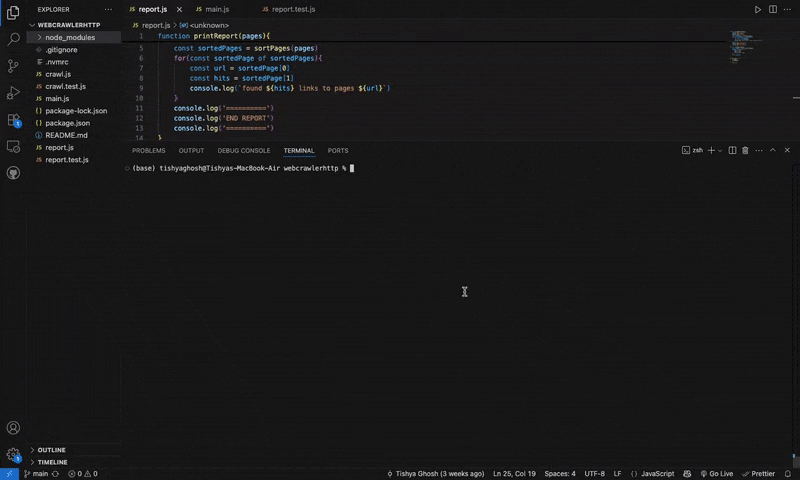

# Crawler.tish
 
A web crawler that extracts links from websites with ease. Built with Node.js and JavaScript.

## Description

This Web Crawler App allows users to input a URL and automatically retrieve structured data such as links, text content, and metadata. It is designed for developers, researchers, and data enthusiasts who want to automate the process of gathering information from websites.

##  Why?

Manual collection from websites is time-consuming, error-prone, and inefficient. This app was created to:

- Automate web data extraction
- Enable scalable and repeatable web crawling
- Learn fundamental backend Technologies

## Usage
Enter a target website URL in the input.

View the results displayed in structured format .

##  Contributing
Contributions are welcome!

If you'd like to improve the app, fix bugs, or add new features.
